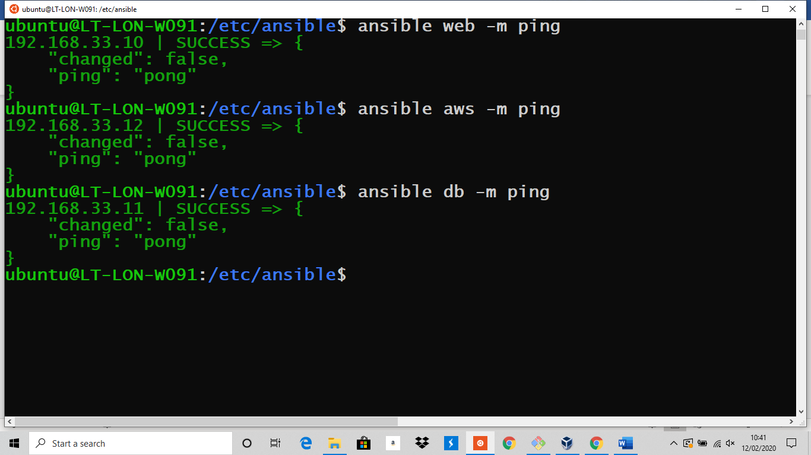
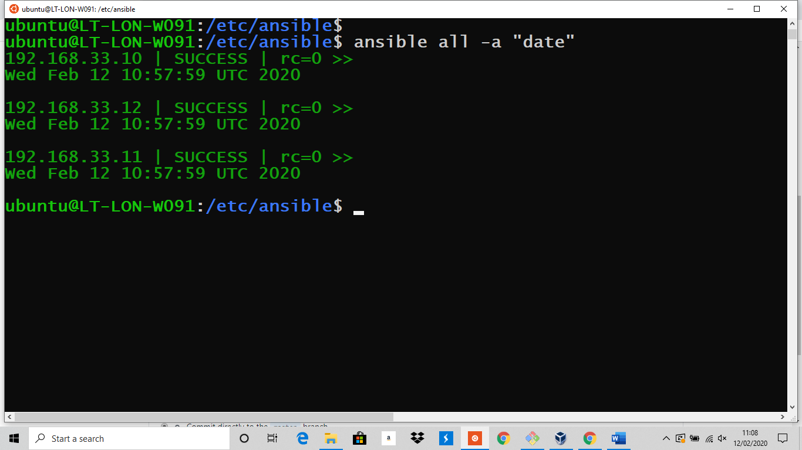
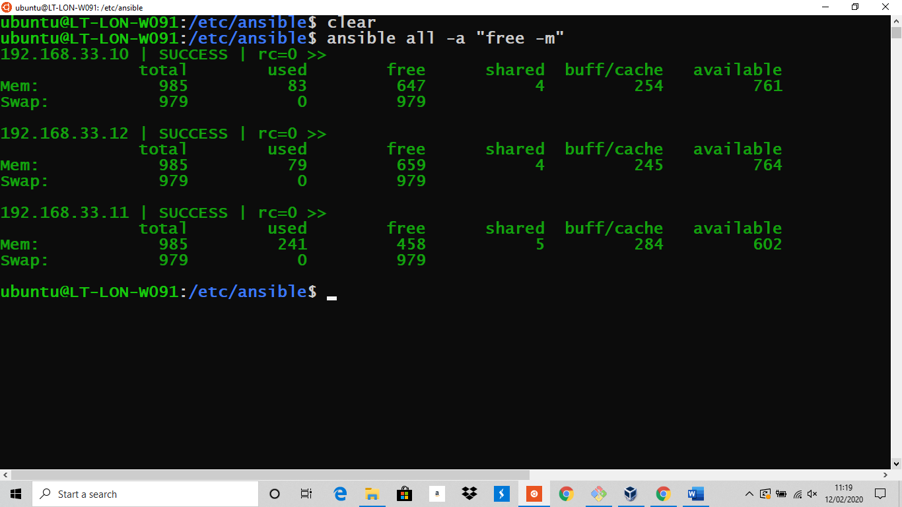
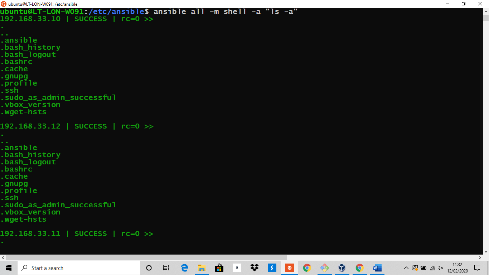
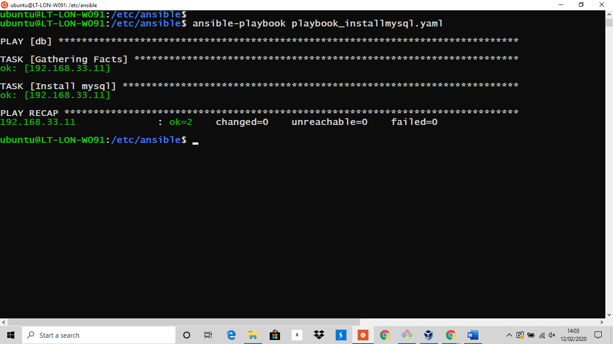
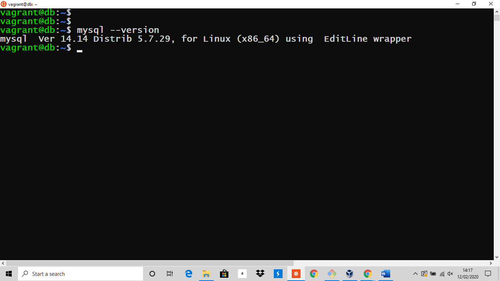

# Infra Structure as Code - Ansible Configuration Management

 ## Understanding Infra Structure as Code (Iac) concepts with Ansible Provisioning

- Pre-requisites
- Virtual Box on windows
- Vagrant Installed

Timings 90-120 Minutes

## This Lesson Includes

- What is Infra structure As Code (IaC)
- Create a Git Hub Repository
- Multi server environment
- Installing Ubuntu 18.04 LTS app on Windows 
- Creating Multiple servers/VMs using vagrant on Windows 
- What is Ansible
- How does it work - Important features and functions 
- Why should we use it
- Ansible Installation
- Setting up SSH keys to access servers/VMs
- Networking
- Vagrant VMs touble shooting
- Ansible Ad-hoc Commands 
- Understanding Ansible file Directory/file Tree
- Ansible Inventory file, Playbook, tasks and Module 
- Basic overview of YAML YET ANOTHER MARKUP LANGUAGE syntax and indentation  
- Creating and running a playbook - Infra structure as code (IAC) example
- Installing MySQL and Nginx to multi servers using Ansible Playbooks

## What is “Infrastructure As Code” (IaC)?
Infrastructure as code (IaC) is the way of defining computing and network infrastructure through source code, the same way you do for applications. Rather than manually configuring your infrastructure or using a one-off isolated script, IaC gives you the power to write code, using a high-level language, to decide how infrastructure should be configured and deployed.

## Why Infra Sturcture as Code (IaC) 
The guiding principle behind IaC is to enforce consistency among DevOps team members by representing the desired state of their infrastructure via code. Moreover, the code can be kept in source control, which means it can be audited, tested on, and used to create reproducible builds with continuous delivery.

Let us walk through the architecture of our exercise 


# What is Ansible
## Simple - Agentless - IT Automation Tool
Ansible is a universal language, unravelling the mystery of how work gets done. Turn tough tasks into repeatable playbooks. Roll out enterprise-wide protocols with the push of a button.

# How does it work
## Simplicity - Ansible functions by connecting via SSH to the clients

## Agentless – There is no need to install a server and an agent that will pull the changes from it.

## Automation
Since it uses SSH, it can very easily connect to clients using SSH-Keys, simplifying through the whole process. Client details, like hostnames or IP addresses and SSH ports, are stored in files called inventory files. 
Its actions/tasks are defined in YAML files called Playbooks

# Why Ansible?
## It is Vital to know why should we use Ansible

With its simplicity, ease-of-use, broad compatibility with most major cloud, database, network, storage, and identity providers amongst other categories.
Ansible has been a popular choice of Engineering teams for configuration-management since 2012. 
Ansible can be used as a source control tool.

- Best thing about Ansible is that you do not need to have advance scripting knowledge.

## How does it fit into DevOps culture and practices
- The growing predominance of multi-cloud and hybrid cloud architectures
- Ansible provides a common platform for enabling mature DevOps and infrastructure as code practices.
- Ansible is easily integrated with higher-level orchestration systems, such as AWS Code-Build, Jenkins, or Red Hat.

## Best Practices -  Create a new Git Hub Repository for Ansible
- Create a cheat-sheet/go to guide for adhoc-commands, playbooks etc. this will build your Git Hub profile and history

## Installation of Ubuntu 18.04 LTS on Windows
Now we will install Ubuntu 18.04 LTS app on Windows and 
Before we do that we need to enable some option on windows 
- Right click on PowerShell to open it as an admin and run below command
- ``` Enable-WindowsOptionalFeature -Online -FeatureName Microsoft-Windows-Subsystem-Linux ```

## Next:
- Type Microsoft Store on your search bar next to windows button on bottom left
- Search for Ubuntu 18.04 LTS– below snap is taken after it was installed

## Follow installation steps
Restart and login to Ubuntu

# Installing Ansible on Ubuntu
## Now Lets start from scratch 
- ``` sudo apt-get update ```
- ``` sudo apt-get install software-properties-common ```
- ``` sudo apt-add-repository ppa:ansible/ansible ```
- ``` sudo apt-get update ```
- ``` sudo apt-get install ansible ```
- press Y (yes) when prompted
- Complete the installation and check with below command
- ``` ansible –version ```


## Above screen shows it has been installed successfully! 

- We will come back to Ansible once we have our Multi VMs environment ready.

## Moving onto creating Multi Server/VMs on Windows using Vagrant:

You have practiced creating 1 VM and now lets take it to next level and use Ansible as provisioning and configuration management tool in multi server environment  
- We will now create 3 Servers/VMs, web , db and aws using vagrant on windows
- We will use Ubuntu as an ansible controller

## Open Git Bash and run it as an administrator
In the same vagrantfile that you used to create 1 VM,  add the following code and comment out the previous code
```ruby
# -*- mode: ruby -*-
# vi: set ft=ruby :

# All Vagrant configuration is done below. The "2" in Vagrant.configure
# configures the configuration version (we support older styles for
# backwards compatibility). Please don't change it unless you know what

# MULTI SERVER/VMs environment 
#
Vagrant.configure("2") do |config|

# creating first VM called web  
  config.vm.define "web" do |web|
    
    web.vm.box = "bento/ubuntu-18.04"
   # downloading ubuntu 18.04 image

    web.vm.hostname = 'web'
    # assigning host name to the VM
    
    web.vm.network :private_network, ip: "192.168.33.10"
    #   assigning private IP
    
    config.hostsupdater.aliases = ["development.web"]
    # creating a link called development.web so we can access web page with this link instread of an IP   
        
    end
  
# creating second VM called db
  config.vm.define "db" do |db|
    
    db.vm.box = "bento/ubuntu-18.04"
    
    db.vm.hostname = 'db'
    
    db.vm.network :private_network, ip: "192.168.33.11"
    
    config.hostsupdater.aliases = ["development.db"]     
    end

# creating third VM called aws 
  config.vm.define "aws" do |aws|
    
    aws.vm.box = "bento/ubuntu-18.04"
    
    aws.vm.hostname = 'aws'
    
    aws.vm.network :private_network, ip: "192.168.33.12"
    
    config.hostsupdater.aliases = ["development.aws"] 
   end
end
```
- Save the code in vagrantfile and run below command
- ```vagrant up```
- It will take few minutes to create 3 VMs
- check the stastus with below command 
- ```vagrant status``` 


## Setup SSH keys/password in the host file.
There are few different ways to set up connection and we will use the fast and easy set up to get going with actual Ansible provisioning.
- Bit of a theory about SSH to have clear concept 
- ```ssh-keygen``` command will generate rsa key pair
- copy the key to server with below command
- ```ssh-copy-id``` root@host
- ```ssh-copy-id``` uses the SSH protocol to connect to the target host and upload the SSH user key.
The command edits the authorised keys file on the server. It creates the .ssh directory if it doesn't exist. It creates the authorised keys file if it doesn't exist. Effectively, ssh key copied to server.

- SSH into our VMs 
- ssh vagrant@ip – ``` ssh vagrant@192.168.33.10 or ssh vagrant@192.168.33.11 ```
- ``` ssh vagrant@db ```  ``` ssh varant@web ```
- password: ```vagrant```

- ```ssh vagrant@aws```


- WOW! We have successfully created multi-server/client environment!

# Trouble-Shooting Tips

# Let us touch base on some common trouble shooting issues before we jump back to Ansible
### Vagrant VM rebooting failure or unable to find private key etc.
- Run this command  and reboot the VM ```echo "nameserver 8.8.8.8" | sudo tee /etc/resolv.conf > /dev/null```
### You can also add following code to your vagrantfile to resolve the issue.
``` 
 config.vm.provider "virtualbox" do |v|
    v.customize ["modifyvm", :id, "--natdnshostresolver1", "on"]
    v.customize ["modifyvm", :id, "--natdnsproxy1", "on"]
end
```
# Back to Ansible now
- back to Ubuntu shell 
- install tree with ```sudo apt install tree ```

- Now go to ``` cd /etc/ansible$```
- Type ```tree``` to see the file tree of ansible directory


- Ansible Inventory file - In the Ansible terminology, an inventory is a file where the target hosts of our actions are specified.
- Its default path is ```/etc/ansible/hosts```
- Open hosts file and add following entry 
``` bash 
[web]
192.168.33.10 ansible_connection=ssh ansible_ssh_user=vagrant ansible_ssh_pass=vagrant
[db]
192.168.33.11 ansible_connection=ssh ansible_ssh_user=vagrant ansible_ssh_pass=vagrant
[aws]
192.168.33.12 ansible_connection=ssh ansible_ssh_user=vagrant ansible_ssh_pass=vagrant
 ```
- In the Ansible hosts file we have three servers web, db and aws
- The IPs must match the hardcoded IPs defined in our vagrantfile to connect via SSH
- ``` ansible_connection=ssh ``` enables ansible to connect to the server with ssh key or password
- ``` ansible_ssh_user=vagrant``` ```ansible_ssh_pass=vagrant``` enable you to connect to VMs with user ID vagrant and password vagrant

- Connect by private key
``` bash 
[web]
192.168.33.10 ansible_ssh_private_key_file=/path/to/file
[db]
192.168.33.11 ansible_ssh_private_key_file=/path/to/file
[aws]
192.168.33.12 ansible_ssh_private_key_file=/path/to/file
 ```
## Now let us check if we can ping our servers
- Use this Command: ``` ping 192.168.33.10 ```
- Use this Command: ``` ping 192.168.33.11 ```


- Great!

## Lets move on to Ansible Ad-hoc commands
- Ping all servers/target hosts Check the connection/status:
- command: ``` ansible all -m ping ```

- Amazing! We got a Pong in renponse of our Ping with a success message from all our servers
- -m is the module.
- How can we ping a particular server
- ``` ansible aws -m ping ```


- To Check the name/version of all hosts OS machines
- Command: ```ansible all -a "uname -a"```
- -a should contain the command it should run which goes as an argument to command and shell.

- This is very useful command to find out the name and version of all Servers connected with Ansible, before performing any actions 

## So when do we actually need to utilise these quick Ad-hoc commands in Real life scenario?

### If we have multiple servers running in different parts of the world and you need to perform some tasks out of business hours in each country/location.


- for example: if you have 1 Server in USA, 1 in Singapore and 1 in Germany
- You will need to check few things before hand
- Such as date and time in each of the zone before start to perform any tasks
- Command to check date and time: ```ansible all -a "date"```


- if you have been tasked to install mysql on all servers or 1 server
- What pre checks would be required to get done ``` Memory availability``` ```disk available space``` etc.
## How to Check the memory on host servers with Ad-hoc commands
- The following ansible ad-hoc command would help you get the desired outcome of all the hosts in the single or all hosts/servers .
- As you could see we are running the free -m command on the remote hosts and collecting the information.
- This is ```best practice``` to check the available space before installing any packages.
- command: ```ansible all -a "free -a"```

- How to check existing directories in all our servers using command inside the VMs shell from Ansible machine 
- command: ``` ansible all -m shell -a "ls -a" ```


## Amazing isn’t it! How smartly we have been communicating with our VMs with Ansible using Ad-hoc commands
- There are plenty more Ad-hoc commands available on Ansible doc page
- ```https://docs.ansible.com/ansible/latest/user_guide/intro_adhoc.html``` 

## The best advantage of Ansible is that it is agentless, therefore we did not need to install Ansible or any dependencies on our servers/VMs and we still successfully ran various different commands on the servers from our Ansible machine.
- Now we have good understanding of Ansible and the ad-hoc commands

### 	Show time! quick exercise to practice some more Ad-hoc commands before we move onto Ansible Playbooks
-	Time 5-10 minutes
-	Find out the ```UPTIME``` of db server using Ansible Ad-hoc command.
-	```update and upgrade all packages``` using Ansible Ad-hoc command.
-	TOP TIP- You can get help from above Ansible Doc link or any other source from internet if required. 

## Now its time to move onto next level to create and use Ansible Playbooks

# Ansible Playbooks

## Playbooks are a completely different way to use ansible than in ad-hoc task execution mode, and are particularly powerful. 
- Playbooks are written in ```YAML Yet Another Mark up Language```, which is easier to understand than a JSON or XML file.
- Each task in the playbook is executed sequentially for each host in the inventory file before moving on to the next task.
- Ansible Playbooks are composed of one or more plays and offer more advanced functionality for sending tasks to managed host compared  to running many ad-hoc commands. 
- Let’s create a simple Ansible playbook example that will installMySQL on the managed hosts that we had already defined in the host file.
``` 
# This is an example of ansible playbook written in YMAL

# YAML FILE STARTS WITH THREE --- DASHES(---)
---
# In this example we are targeting server called db

- hosts: db
# hosts is to define the name of your host machine, group or all servers
 
 gather_facts: yes
# gethering facts before performing any tasks
 
  become: true
 # become is used to get root permission to perform any tasks that may require admin access
 
 #Tasks are executed in order, one at a time, against all Servers matched by the host pattern
# Every task should have a name, which is included in the output from running the playbook

  tasks:
  - name: Install mysql
  
    # installing Mysql on db
    apt: pkg=mysql-server state=present

# The goal of each task is to execute a module, with very specific arguments.

- # TOP TIP: Be mindful of the INDENTATION of syntax in YML
  

```
- Save the file as playbook_installmysql.yml in ```/etc/ansible```
- Run the playbook with this command:``` ansible-playbook playbook_installmysql.yml ```


- Mysql has been installed on db server, now lets login to db server from our Ansible machine via ssh
- ```ssh vagrant@db```
- Enter the passord: ```vagrant```
- Verfiy if mysql has been installed with this command: ```mysql --version```

## Great! 

# Its show time
- Playbooks are reusable with simple modification.

## Exercise: 20 minutes
- Create 1 playbook to install:
- Nginx on db server
- Mysql on web server
- Both packages on aws server
- Update and upgrade the packages on all the servers

